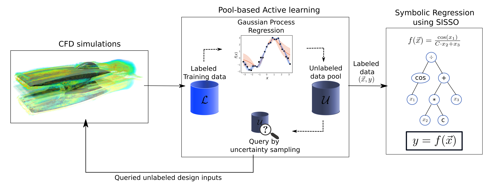

# Active learning symbolic regression, CFD + AI = Wow



## Installation

You can install using pip once you clone this repo:
```
pip install alcfd@git://github.com/ur-whitelab/alcfd.git
```

### Pre-requisites
- ANSYS license to run CFD simulations. 
- `jupyter` to run example notebooks 

### SISSO installation and usage
SISSO is written in FORTRAN and needs to be compiled. You can find instructions on installing SISSO [here](https://github.com/rouyang2017/SISSO).

For this project, the `src/SISSO.f90` in their source code was changed. A patch file is provided in the `Patches/` directory. Note: This patch is hard coded for the features that we used for our CFD systems. Users should change this depending on their system.

## Usage 
Refer to jupyter notebooks provided in the `examples/` directory for example usage of CFD and Active Learning (AL) methods. Note that current working example models are compatible with ANSYSWB >= v2020R2.

To run SISSO on `train.dat` file using `SISSO.in` (both generated during AL), use this command:
```bash
mpirun -n 1 SISSO
```

## Contributing
Please use the Issue Tracker to report bugs, installation problems, and feature requests.

Pull requests for bug fixes and enhancements are very welcome. See http://makeapullrequest.com for a general introduction on how make a pull request and contribute to open source projects. 

## Citing
[Preprint]()

## License
[](https://www.gnu.org/licenses/gpl-3.0)

&copy; ALCFD Developers
